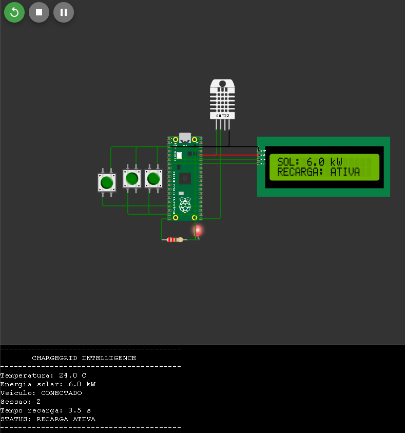
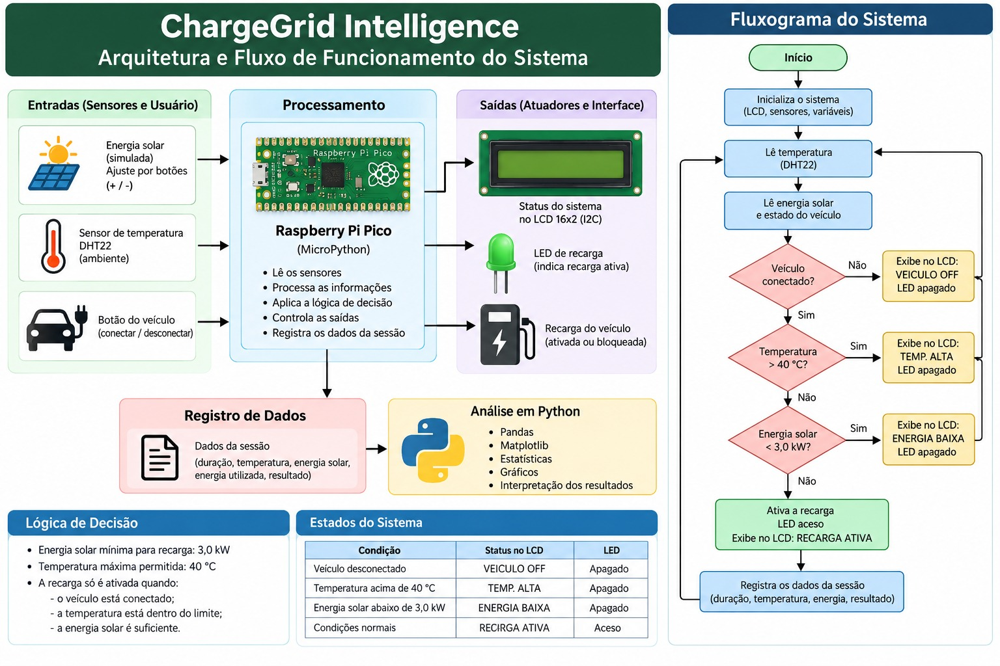
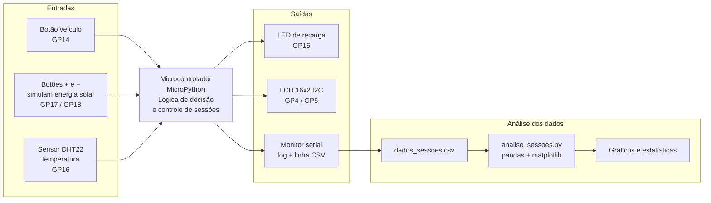
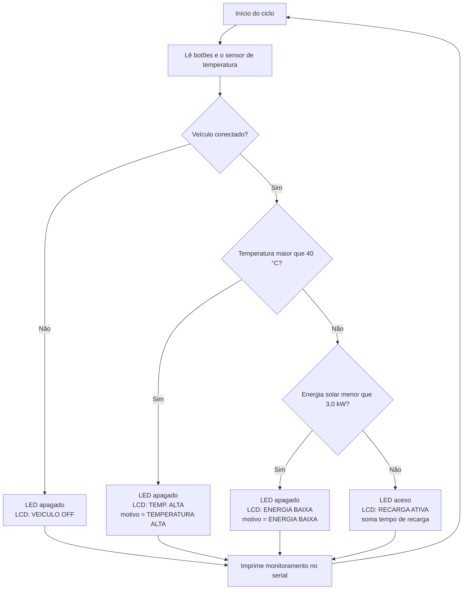
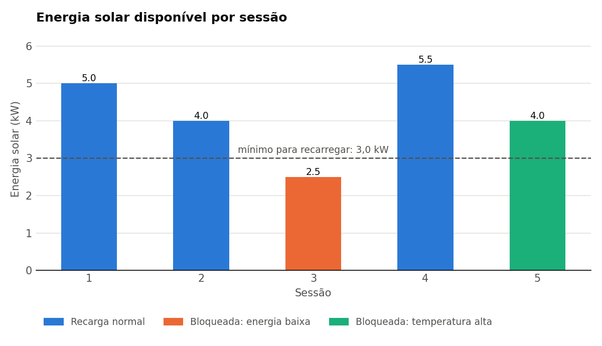
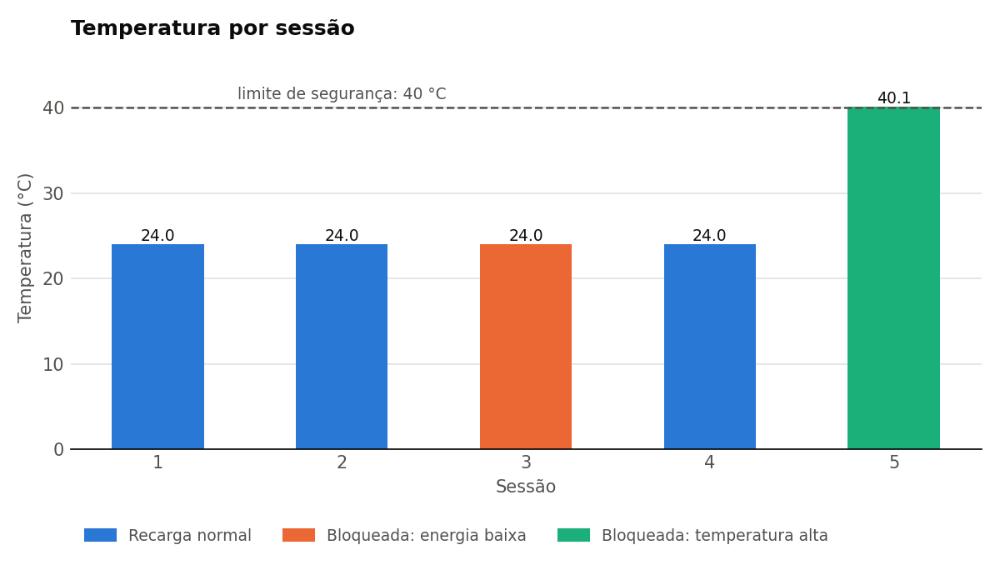
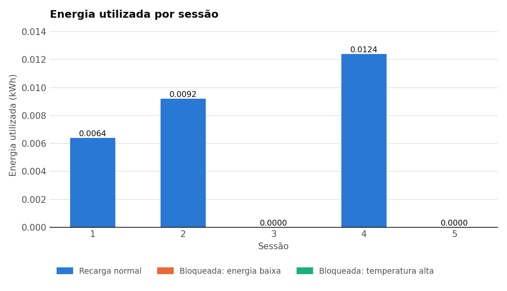
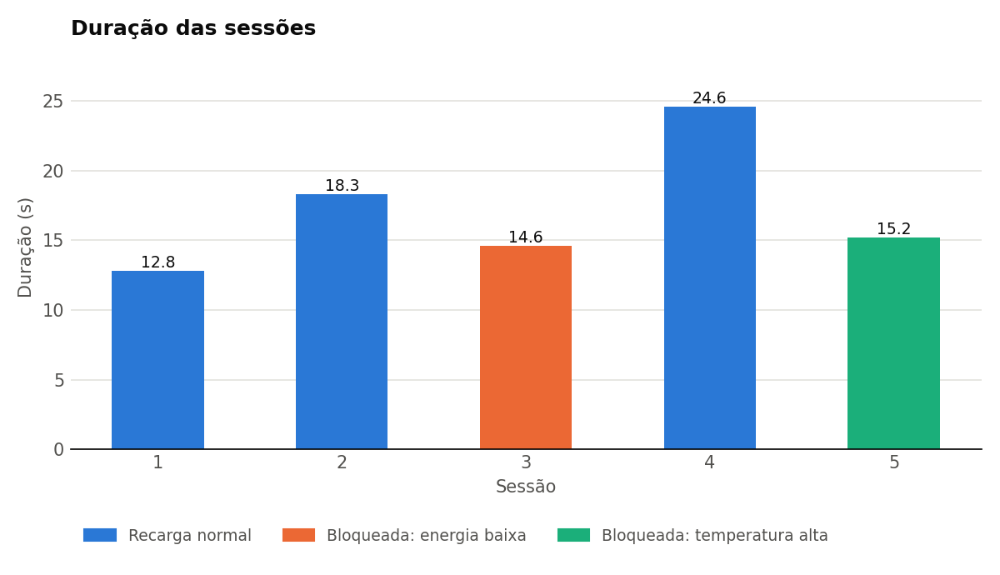
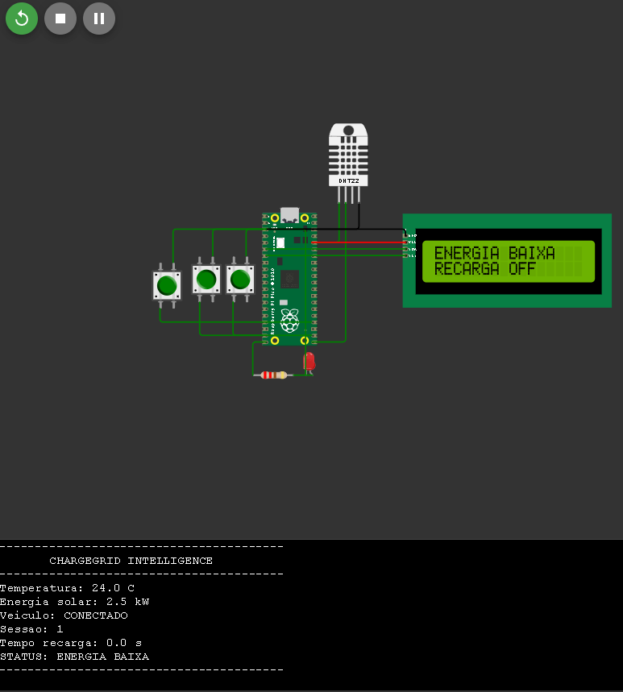
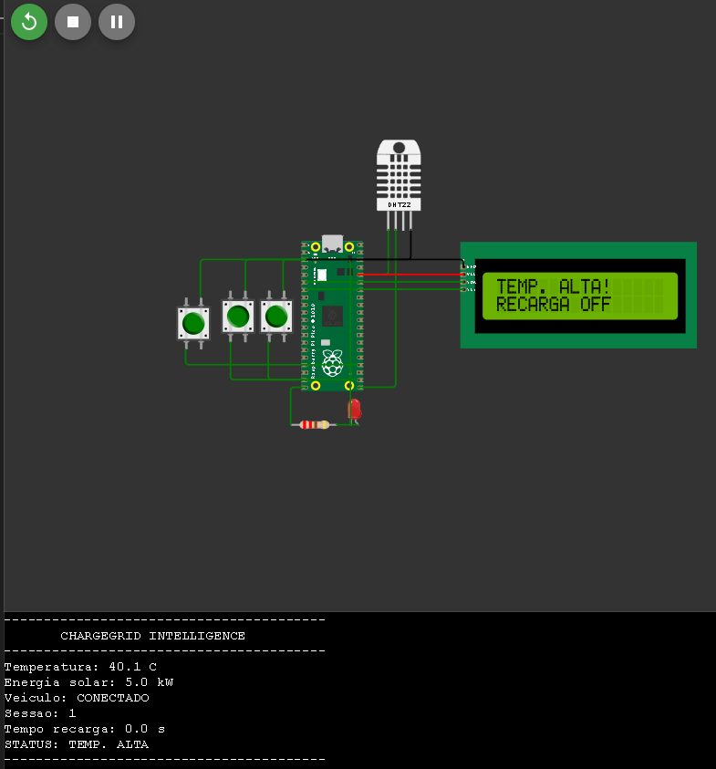

# ChargeGrid Intelligence

**Sistema inteligente de gerenciamento de recarga de veículos elétricos com energia solar**

Sprint 3 – Prototipagem Funcional e Integração

---

## 1. Equipe

| Nome | RM |
|------|----|
| Vinicius Sanches Chiarle | 568846 |
| Mateus Felipe Curtale Serafim | 571129 |
| Julia Nunes Frederici | 569858 |
| Maria Beatriz Braga de Lima | 570501 |
| Rafael Almeida Rebello | 570642 |

Disciplina: Pensamento Computacional e Automação com Python

---

## 2. Visão geral

O ChargeGrid Intelligence simula um ponto de recarga de veículos elétricos que **só carrega o veículo
quando há energia solar suficiente e a temperatura está em nível seguro**. O protótipo é **simulado
no Wokwi** e roda em MicroPython.

- **Link do projeto no Wokwi:** https://wokwi.com/projects/475558937320053761
- **Repositório no GitHub:** https://github.com/RafaBoleta/chargegrid-intelligence
- **Vídeo de demonstração:** https://youtu.be/H0aTAqBBaGw

O sistema faz quatro coisas de forma automática:

1. Abre e fecha **sessões de recarga** quando o veículo é conectado ou desconectado.
2. **Decide** se a recarga pode acontecer, com base na energia solar disponível e na temperatura.
3. **Mostra** o status em tempo real no LCD, no LED e no monitor serial.
4. **Registra** cada sessão (duração, temperatura, energia solar, energia utilizada e resultado) em
   uma linha CSV, que depois é analisada com Python.

---

## 3. Esquema de integração dos componentes

### 3.1 Componentes e ligações

| Componente | Função no sistema | Pino |
|------------|-------------------|------|
| Microcontrolador Raspberry Pi Pico | Executa a lógica de decisão, controla as sessões e gera os dados | – |
| Botão "veículo" | Simula a conexão e a desconexão do veículo elétrico | GP14 |
| Botão "+" | Simula aumento da geração solar (+0,5 kW, máximo 6,0 kW) | GP17 |
| Botão "−" | Simula redução da geração solar (−0,5 kW, mínimo 0,0 kW) | GP18 |
| Sensor DHT22 | Mede a temperatura do ponto de recarga | GP16 |
| LED de recarga | Aceso = recarga ativa; apagado = recarga bloqueada ou sem veículo | GP15 |
| Resistor de 220 Ω | Limita a corrente do LED (entre o GP15 e o ânodo do LED) | – |
| Display LCD 16x2 com interface I2C (endereço 0x27) | Mostra o status para o usuário | SDA GP4 · SCL GP5 |
| Monitor serial | Exibe o monitoramento contínuo e o resumo de cada sessão em CSV | USB/UART |

> O circuito original tinha um potenciômetro que o código não usa, com o sinal ligado ao GP16 (o mesmo
> pino do DHT22). Ele foi removido no `wokwi/diagram.json` para não interferir na leitura de temperatura.

Circuito montado no Wokwi (versão corrigida, sem o potenciômetro), com a recarga ativa e o LED aceso:



### 3.2 Diagrama de arquitetura e fluxo do sistema

Visão geral: entradas, processamento, saídas, registro de dados, análise em Python, lógica de
decisão, estados do sistema e fluxograma.



### 3.2.1 Diagrama de blocos (versão editável em Mermaid)



### 3.3 Fluxograma da lógica de decisão

Este fluxo se repete a cada ciclo do laço principal (aproximadamente a cada 0,5 s).



### 3.4 Ciclo de vida de uma sessão

| Evento | O que o sistema faz |
|--------|---------------------|
| Botão do veículo pressionado (desconectado → conectado) | Incrementa o número da sessão, zera o tempo de recarga e guarda o instante de início |
| Durante a sessão | Acumula tempo de recarga apenas enquanto a recarga estiver ativa; registra o motivo se houver bloqueio |
| Botão do veículo pressionado (conectado → desconectado) | Calcula a duração e a energia utilizada, imprime o resumo e uma linha CSV, salva no histórico |

Energia utilizada = potência de recarga (3,3 kW) × tempo de recarga ÷ 3600, em kWh.

---

## 4. Justificativa técnica das escolhas

As escolhas consideraram a necessidade de construir um protótipo funcional capaz de demonstrar a
integração entre automação, energia renovável e programação.

| Escolha | Por quê |
|---------|---------|
| **Raspberry Pi Pico** | Unidade principal de processamento: lê os sensores e os botões, executa a lógica de automação em MicroPython, verifica as condições da recarga e controla as saídas (LED e display). Tem pinos de entrada/saída e I2C |
| **MicroPython** | Linguagem simples e legível, boa para prototipar e depurar rápido, com acesso direto a pinos, I2C e sensores. Mantém o projeto na mesma linguagem estudada na disciplina (Python) |
| **Sensor DHT22** | Monitora a temperatura do ambiente e demonstra uma condição de segurança: acima de 40 °C a recarga é bloqueada. É um sensor digital comum, com simulação nativa no Wokwi |
| **Display LCD 16x2 com I2C** | Interface simples para mostrar o estado do sistema (VEICULO OFF, RECARGA ATIVA, ENERGIA BAIXA, TEMP. ALTA). O protocolo I2C usa poucos pinos do Pico (SDA e SCL) |
| **Três botões** | Um simula a conexão e a desconexão do veículo; os outros dois aumentam ou diminuem a energia solar disponível. Assim é possível reproduzir diferentes situações sem uma fonte real de energia solar. Em um sistema real, esse valor viria de um inversor ou de um medidor da usina |
| **LED de recarga** | Indicador visual imediato: aceso com recarga ativa; apagado com recarga bloqueada ou veículo desconectado |
| **Simulação no Wokwi** | Permite testar conexões, sensores, botões, display e lógica sem componentes físicos, e repetir condições de energia e temperatura observando a resposta automática do sistema |
| **Saída serial em CSV** | Transforma cada sessão em dado estruturado, pronto para análise com pandas sem conversão manual |
| **Python, Pandas e Matplotlib** | Em uma segunda etapa, organizam os dados das sessões em um DataFrame, calculam as estatísticas e geram os gráficos de energia solar, energia utilizada e duração |
| **Limites de 3,0 kW e 40 °C** | Valores de referência da simulação: 40 °C é o limite de segurança térmica; 3,0 kW é o mínimo de energia solar para liberar a recarga, próximo à potência de recarga simulada de 3,3 kW |

### Como cada tecnologia contribui

| Eixo | Contribuição no projeto |
|------|-------------------------|
| **Sustentabilidade** | A recarga só é liberada quando há geração solar suficiente, priorizando energia renovável |
| **Automação inteligente** | O sistema decide sozinho quando liberar ou bloquear a recarga, sem intervenção humana, e registra o motivo |
| **Eficiência energética** | O bloqueio evita puxar energia quando a geração é insuficiente; o histórico por sessão permite medir consumo e acompanhar o uso |

---

## 5. Resultados e dados funcionais

Foram registradas **5 sessões** no Wokwi. A saída CSV do monitor serial está em
[`data/dados_sessoes.csv`](data/dados_sessoes.csv) e foi processada por
[`analysis/analise_sessoes.py`](analysis/analise_sessoes.py).

| Sessão | Duração (s) | Temperatura (°C) | Energia solar (kW) | Energia utilizada (kWh) | Resultado |
|:------:|:-----------:|:----------------:|:------------------:|:-----------------------:|-----------|
| 1 | 12,8 | 24,0 | 5,0 | 0,0064 | Recarga normal |
| 2 | 18,3 | 24,0 | 4,0 | 0,0092 | Recarga normal |
| 3 | 14,6 | 24,0 | 2,5 | 0,0000 | Energia baixa (bloqueada) |
| 4 | 24,6 | 24,0 | 5,5 | 0,0124 | Recarga normal |
| 5 | 15,2 | 40,1 | 4,0 | 0,0000 | Temperatura alta (bloqueada) |

A sessão 5 foi registrada em outra execução do Wokwi (aparecia como sessão 2 no monitor serial) e foi
renumerada para manter os identificadores únicos.

| Indicador | Valor |
|-----------|-------|
| Duração média | 17,10 s |
| Temperatura média | 27,2 °C |
| Energia solar média | 4,20 kW |
| Energia utilizada total | 0,0280 kWh |
| Sessões com recarga normal | 3 de 5 (60%) |
| Sessões bloqueadas pela automação | 2 de 5 (40%): 1 por energia baixa e 1 por temperatura alta |
| Maior duração e maior energia utilizada | Sessão 4 (24,6 s e 0,0124 kWh) |









### O que os dados mostram

- **A automação funcionou nos três cenários testados.** Nas sessões 1, 2 e 4, com geração entre 4,0 e
  5,5 kW e temperatura de 24 °C, a recarga foi liberada. Na sessão 3, com 2,5 kW (abaixo do mínimo de
  3,0 kW), o sistema bloqueou a recarga e a energia utilizada foi zero, mesmo com o veículo conectado por
  14,6 s.
- **A proteção térmica atuou no limite.** Na sessão 5, a temperatura estava em 40,1 °C (logo acima do
  limite de 40 °C) e a energia solar em 4,0 kW, suficiente para recarregar. Mesmo assim, o sistema
  bloqueou a recarga (energia utilizada 0,0000 kWh) e registrou o motivo TEMPERATURA ALTA.
- **A energia utilizada cresce com a duração da recarga**, como esperado para uma potência
  constante de 3,3 kW.

### Prints da execução no Wokwi

Nos três prints abaixo, o LED e o LCD respondem à decisão do sistema. Cada print vem de uma execução
diferente do Wokwi, por isso os números de sessão do monitor serial não seguem a tabela de resultados.

Recarga ativa (energia solar de 6,0 kW, LCD "RECARGA: ATIVA", **LED aceso**, tempo de recarga de 3,5 s sendo contado):


Recarga bloqueada por energia baixa (2,5 kW, abaixo do mínimo de 3,0 kW), com o veículo conectado, **LED apagado** e tempo de recarga 0,0 s:



Recarga bloqueada por temperatura alta (40,1 °C, acima do limite de 40 °C, com 5,0 kW de energia solar, suficiente para recarregar), veículo conectado, LCD "TEMP. ALTA! / RECARGA OFF", **LED apagado** e tempo de recarga 0,0 s:



Resumo final da sessão: ao desconectar o veículo, o monitor serial imprime um bloco "SESSAO FINALIZADA"
com o número da sessão, a duração, a temperatura, a energia solar, o tempo de recarga, a energia utilizada
e o resultado, seguido de uma linha CSV. Exemplo com os dados da sessão 1:

```
SESSAO FINALIZADA
Sessao: 1
Duracao: 12.8 segundos
Temperatura: 24.0 C
Energia solar: 5.0 kW
Tempo de recarga: cerca de 7 segundos
Energia utilizada: 0.0064 kWh
Resultado: RECARGA NORMAL

CSV:
1;12.8;24.0;5.0;0.0064;RECARGA NORMAL
```

Bloqueio por temperatura alta (comportamento programado no código): com o veículo conectado, se o DHT22
medir mais de 40 °C, o LED apaga, o LCD mostra "TEMP. ALTA / RECARGA OFF" e o motivo registrado na sessão
é TEMPERATURA ALTA, mesmo que a energia solar seja suficiente (a checagem de temperatura vem antes da de
energia). Esse comportamento foi confirmado na sessão 5 (linha CSV no formato `5;15.2;40.1;4.0;0.0000;TEMPERATURA ALTA`).

### Limitações e próximos passos

- **Tempo de recarga contado a menos.** O código soma 0,5 s por volta do laço, mas cada volta leva
  mais que isso (atualização do LCD, leitura do sensor e pausas dos botões). Nas 3 sessões com
  recarga, o tempo de recarga calculado a partir da energia (t = E ÷ 3,3 kW) ficou em cerca de 55% da
  duração da sessão. Correção prevista: medir o tempo com `time.ticks_ms()` em vez de somar 0,5 s.
  `[ATUALIZAR se o código for corrigido e os dados coletados novamente]`
- **Poucas sessões, e a proteção por temperatura foi testada uma única vez.** Nas sessões 1 a 4 o DHT22
  ficou em 24 °C (valor padrão do Wokwi) e só a sessão 5 passou do limite de 40 °C. São dados de
  demonstração, e não uma amostra estatística.
- **LED ligado ao contrário no circuito original (corrigido).** O resistor do GP15 ia para o cátodo do
  LED e o ânodo ia para o GND, ou seja, o LED estava com polaridade invertida e nunca acendia. Foi
  corrigido (GP15 → resistor → ânodo; cátodo → GND, como em `wokwi/diagram.json`) e os prints acima
  mostram o LED aceso na recarga ativa e apagado nos bloqueios. Os valores do CSV não dependem do LED.
- **Energia solar simulada.** O valor vem dos botões, não de um painel real.
- **Valores pequenos em kWh.** As sessões duram segundos, então a energia é da ordem de milésimos de
  kWh. Um fator de aceleração do tempo (por exemplo, 1 s = 1 min) deixaria os números mais próximos
  de uma recarga real.

---

## 6. Conexão com os conteúdos da disciplina

O projeto se relaciona com a disciplina de **Pensamento Computacional e Automação com Python**, porque
aplica conceitos de programação para resolver um problema prático de forma estruturada.

| Conteúdo da disciplina | Onde aparece no projeto |
|------------------------|-------------------------|
| **Variáveis** | `energia_solar = 5.0`, `ENERGIA_MINIMA = 3.0`, `TEMPERATURA_MAXIMA = 40.0` e `POTENCIA_RECARGA = 3.3` guardam as condições do sistema e permitem mudar seu comportamento durante a execução |
| **Estruturas condicionais** | `if`, `elif` e `else` implementam a decisão automática: se há veículo, se a temperatura passa do limite e se a energia solar é suficiente para manter ou bloquear a recarga |
| **Estruturas de repetição** | Um laço `while True` monitora continuamente temperatura, energia solar, estado do veículo, botões e condição da recarga, respondendo às mudanças durante a simulação |
| **Funções** | `ler_temperatura()` e `mostrar_lcd()` organizam partes específicas do programa e facilitam a leitura e a manutenção do código |
| **Listas e dicionários** | A lista `historico_sessoes` guarda o histórico, e cada sessão é um dicionário com duração, temperatura, energia solar, energia utilizada e resultado |
| **Entrada, processamento e saída** | Entradas: DHT22, botões, estado do veículo e energia solar simulada. Processamento: Raspberry Pi Pico, lógica condicional e comparação com os limites. Saídas: LED, LCD, mensagens no console, registros das sessões e dados para análise em Python |
| **Manipulação e análise de dados (Pandas)** | Os dados das sessões foram organizados em um DataFrame para calcular duração média, temperatura média, energia solar média, energia utilizada total, maiores valores e a contagem de sessões normais e bloqueadas |
| **Visualização de dados (Matplotlib)** | Gráficos de energia solar, energia utilizada e duração das sessões |
| **Automação e tomada de decisão** | O sistema libera ou bloqueia a recarga sozinho e registra o motivo |

Dessa forma, o projeto integra os conceitos estudados na disciplina com uma aplicação prática de
programação, pensamento computacional, automação e análise de dados, demonstrando como esses
conhecimentos podem ser usados em um sistema inteligente de gerenciamento de recarga.

---

## 7. Como executar

### 7.1 Simulação no Wokwi

1. Abra o projeto: https://wokwi.com/projects/475558937320053761.
2. Clique em **Start the simulation** e abra o monitor serial.
3. Pressione o **botão do veículo** para iniciar uma sessão.
4. Use **+** e **−** para variar a energia solar e observe o LED e o LCD.
5. Pressione o botão do veículo de novo para encerrar a sessão e ver o resumo e a linha CSV.
6. Para testar o bloqueio por temperatura, clique no DHT22 e ajuste a temperatura para mais de 40 °C.

### 7.2 Análise dos dados

```bash
pip install pandas matplotlib
python analysis/analise_sessoes.py
```

O script lê `data/dados_sessoes.csv`, imprime as estatísticas e salva os gráficos em `docs/`.

---

## 8. Estrutura do repositório

```
chargegrid-intelligence/
├── README.md
├── src/
│   ├── main.py              # código do protótipo (MicroPython)     
│   ├── i2c_lcd.py           # biblioteca do LCD                     
│   └── lcd_api.py           # biblioteca do LCD                      
├── wokwi/
│   └── diagram.json         # circuito exportado do Wokwi             
├── data/
│   └── dados_sessoes.csv    # dados das sessões
├── analysis/
│   └── analise_sessoes.py   # estatísticas e gráficos
└── docs/
    ├── arquitetura_chargegrid.jpg   # diagrama de arquitetura e fluxo
    ├── wokwi_recarga_ativa.png      # print da recarga ativa (LED aceso)
    ├── wokwi_energia_baixa.png      # print do bloqueio por energia baixa
    ├── wokwi_temperatura_alta.png   # print do bloqueio por temperatura alta
    ├── grafico_energia_solar.png
    ├── grafico_temperatura.png
    ├── grafico_energia_utilizada.png
    └── grafico_duracao.png
```
